# Material Forge

**AI-Powered Material Transformation Pipeline for Designers**

Transform any design into every possible material using Gemini 2.5 Flash Image Preview (Nano Banana). Upload a sketch, photo, or design and watch it come to life in wood, metal, glass, fabric, and dozens of other materials.

## 🎯 What is Material Forge?

Material Forge is an innovative AI tool that solves a core design workflow problem: **material exploration**. Designers typically spend hours or days manually exploring how their creations would look in different materials. Material Forge compresses this process from days to minutes using advanced AI.

### The Magic Behind It

1. **Upload** any design image (sketch, photo, 3D render)
2. **AI Analysis** detects current material and suggests 20+ alternatives
3. **Parallel Transformation** generates your design in every material simultaneously
4. **Quality Validation** ensures each transformation maintains design consistency
5. **Interactive Gallery** lets you explore, compare, and download all variations

## 🚀 Features

- **20+ Material Transformations**: Wood, metal, glass, stone, fabric, synthetics, and more
- **Smart Material Detection**: Avoids redundant transformations by detecting current material
- **Quality Validation**: AI validates each transformation for accuracy
- **Image Suitability Check**: Validates uploaded images are suitable for material transformation
- **Download All**: Export individual images or complete material sets

## 🛠️ Quick Start

### Prerequisites

- Node.js 18.0 or higher (for local development)
- Gemini API key (get one at [ai.google.dev](https://ai.google.dev))

### Local Development

1. **Clone the repository**
   ```bash
   git clone https://github.com/felipemeres/materialforge.git
   cd materialforge
   ```

2. **Install dependencies**
   ```bash
   npm install
   ```

3. **Configure API Key**
   
   Create a `.env.local` file in the project root and add your Gemini API key:
   ```bash
   NEXT_PUBLIC_GEMINI_API_KEY=your_actual_api_key_here
   ```
   
   **Important:** Never commit your actual API key to version control. The `.env.local` file is already excluded in `.gitignore`.

4. **Start the development server**
   ```bash
   npm start
   # or npm run dev
   ```

5. **Open in browser**
   ```
   http://localhost:3000
   ```

## 📖 Usage

### Basic Workflow

1. **Upload Design**: Drag and drop or click to upload your design image
2. **Wait for Processing**: AI analyzes and transforms your design (1-3 minutes)
3. **Explore Results**: Browse the gallery of material transformations
4. **View Full Size**: Click any image for full-screen viewing with navigation
5. **Download**: Save individual images or the complete set

### Supported Image Types

**✅ Great for Material Transformation:**
- Product designs and sketches
- Furniture and architectural elements
- Tools, accessories, and objects
- 3D renders and technical drawings
- Simple, clear designs with recognizable shapes

**❌ Not Suitable:**
- Photos of people or animals
- Complex scenes with multiple objects
- Landscapes or natural environments
- Abstract art or patterns
- Food items or organic matter

## 🏗️ Technical Architecture

### AI Pipeline Overview

```mermaid
flowchart LR
    A["User Upload<br/>📷 Image"] --> B["Material Detection<br/>🔍 Gemini Flash"]
    B --> C["Material Discovery<br/>🧠 AI Analysis"]
    C --> D["Parallel Transformation<br/>⚡ Nano Banana"]
    E["Quality Validation<br/>✅ Gemini Flash"] --> F["Interactive Gallery<br/>🖼️ Results"]
    
    D --> D1["Transform to<br/>each material"]
    D1 --> E
```



### Core Components

- **Material Discovery**: Gemini 2.5 Flash analyzes designs and suggests compatible materials
- **Image Transformation**: Gemini 2.5 Flash Image Preview (Nano Banana) performs material transformations
- **Quality Validation**: Gemini .5 Flash validates transformation accuracy
- **Parallel Processing**: Batch processing with configurable batch size (default: 5)
- **Retry Logic**: Up to 3 attempts per material for failed transformations

## 🔧 Configuration

### API Limits

The application is designed to work within Gemini's daily API limits:
- **Batch Size**: 5 materials processed in parallel
- **Material Count**: 20+ materials per transformation
- **Retry Logic**: 3 attempts per failed material

### Customization

You can modify these settings in `server.js`:

```javascript
// Batch processing configuration
const BATCH_SIZE = 5; // Line 329

// Material discovery prompt (lines 384-426)
// Add or modify material categories and descriptions

// Transformation prompt (lines 486-501)  
// Adjust transformation instructions and quality requirements
```

## 🤝 Contributing

Material Forge was created for the Kaggle Nano Banana Hackathon. Contributions are welcome!

1. Fork the repository
2. Create a feature branch (`git checkout -b feature/amazing-feature`)
3. Commit your changes (`git commit -m 'Add amazing feature'`)
4. Push to the branch (`git push origin feature/amazing-feature`)
5. Open a Pull Request

## 📄 License

This project is licensed under the MIT License - see the [LICENSE](LICENSE) file for details.